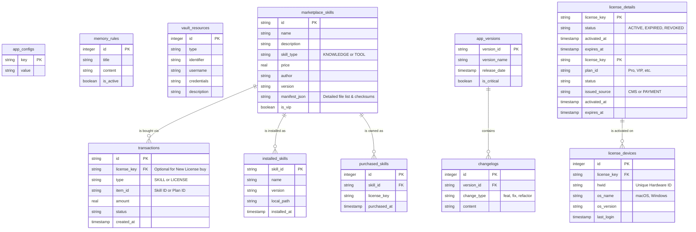

# Tài Liệu Thiết Kế Cơ Sở Dữ Liệu - OmniMind

Tài liệu này mô tả chi tiết cấu trúc Database tổng thể dành cho dự án OmniMind. Các bảng đã được phân loại rõ ràng: **[CLIENT-SQLITE]** (Chỉ chạy trên máy người dùng), **[SERVER-POSTGRES]** (Chỉ nằm trên CMS Backend), và **[BOTH]** (Nằm trên Server nhưng có sync/cache xuống Client).

> [!NOTE]
> **Tham chiếu Dự án:** Bảng [SERVER-POSTGRES] được quản lý tại `projects/license-server/` (PostgreSQL `db_license` trên VPS). Migration file: `omnimind_migration.sql`. CMS Dashboard: `projects/license-dashboard/`.

## 1. Sơ đồ Quan hệ (ER Diagram)



---

## 2. Giải Pháp Quản Lý Kỹ Năng Đa Thành Phần (Manifest-driven)

Để hỗ trợ mở rộng các loại Skill khác nhau (chỉ có mô tả hoặc có cả code tool), OmniMind sử dụng cơ chế **Manifest**.

### 2.1 Phân loại Kỹ năng (`skill_type`)
- **`KNOWLEDGE`**: Chỉ bao gồm các tệp văn bản/markdown (quy tắc, kiến thức). AI sẽ đọc để làm ngữ cảnh.
- **`TOOL`**: Ngoài văn bản, còn bao gồm mã nguồn (Python, scripts) để AI có thể thực thi (gọi công cụ).

### 2.2 Cấu trúc Manifest (`manifest_json`)
CMS sẽ đóng gói Skill và cung cấp một chuỗi JSON mô tả danh sách tệp. Client dựa vào đây để tải và đặt vào đúng vị trí:
```json
{
  "files": [
    {"path": "SKILL.md", "type": "metadata", "hash": "sha256..."},
    {"path": "scripts/scraper.py", "type": "executable", "hash": "sha256..."},
    {"path": "assets/icon.png", "type": "asset", "hash": "sha256..."}
  ],
  "dependencies": ["requests", "beautifulsoup4"]
}
```

### 2.3 Cấu trúc lưu trữ tại Client
Mọi Skill được tải về sẽ lưu tại thư mục `[app_data]/skills/[skill_id]/` với cấu trúc:
- `/` : Chứa `SKILL.md` (metadata chính).
- `/scripts/` : Chứa mã nguồn thực thi (nếu `type` là `TOOL`).
- `/assets/` : Chứa hình ảnh, icons.

---

## 3. Mô tả Chi tiết các Bảng

### 3.1 Bảng `app_configs` [CLIENT-SQLITE]
Lưu trữ toàn bộ cấu hình cục bộ của hệ thống dưới dạng Key-Value để tối đa hoá khả năng mở rông.
- **`key`** (TEXT, PK): Định danh cấu hình (VD: `telegram_token`, `workspace_path`, `license_key`, `theme`).
- **`value`** (TEXT): Giá trị cấu hình tương ứng.

### 3.2 Bảng `memory_rules` [CLIENT-SQLITE]
Lưu trữ các quy tắc hệ thống (System Prompts) cục bộ để định hướng hành vi AI.
- **`id`** (INTEGER, PK): ID tự tăng.
- **`title`** (TEXT): Tiêu đề quy tắc.
- **`content`** (TEXT): Nội dung quy tắc chi tiết.
- **`is_active`** (BOOLEAN): Trạng thái kích hoạt (Chỉ các quy tắc Active mới được bơm vào AI).

### 3.3 Bảng `vault_resources` [CLIENT-SQLITE]
Lưu trữ tài nguyên nhạy cảm nội tại của máy người dùng (SSH, Database, API Keys, OS Account).
- **`id`** (INTEGER, PK): ID tự tăng.
- **`type`** (TEXT): Loại tài nguyên (SSH, LDAP, API, DB...).
- **`identifier`** (TEXT): Host, IP hoặc định danh nhà cung cấp.
- **`username`** (TEXT): Tên đăng nhập.
- **`credentials`** (TEXT): Mật khẩu/Token (BẮT BUỘC MÃ HOÁ TRƯỚC KHI LƯU).
- **`description`** (TEXT): Ghi chú bổ sung.

### 3.4 Bảng `marketplace_skills` [BOTH]
Master data nằm trên Server CMS. Client sẽ lưu Cache danh mục này vào SQLite từ API Server Marketplace để load nhanh.
- **`id`** (TEXT, PK): ID định danh kỹ năng toàn cầu.
- **`name`** (TEXT): Tên kỹ năng.
- **`description`** (TEXT): Mô tả chức năng.
- **`skill_type`** (TEXT): Loại (`KNOWLEDGE` hoặc `TOOL`).
- **`price`** (REAL): Giá bán (0 nếu miễn phí).
- **`author`** (TEXT): Tác giả.
- **`version`** (TEXT): Phiên bản hiện tại trên Store.
- **`manifest_json`** (TEXT): Danh sách tệp và thông tin cài đặt (JSON).
- **`is_vip`** (BOOLEAN): Đánh dấu kỹ năng cao cấp.

### 3.5 Bảng `transactions` [SERVER-POSTGRES]
Lưu trữ trên Server. Theo dõi lịch sử và trạng thái thanh toán online của toàn bộ hệ thống. Client chỉ POST API tạo giao dịch, không lưu bảng này vào SQLite.
- **`type`** (TEXT): Loại giao dịch (`SKILL` hoặc `LICENSE`).
- **`item_id`** (TEXT): ID của kỹ năng hoặc ID của gói License (Plan).
- **`license_key`** (TEXT, FK): License liên kết (Để trống nếu đây là giao dịch mua License mới).
- **`amount`** (REAL): Số tiền thanh toán.
- **`status`** (TEXT): Trạng thái (`PENDING`, `SUCCESS`, `FAILED`).
- **`created_at`** (TIMESTAMP): Thời gian khởi tạo.

### 3.6 Bảng `purchased_skills` [BOTH]
Xác nhận quyền sở hữu của một License đối với một Skill (Biên lai điện tử). Có lưu cache tại SQLite Client để chứng minh quyền offline.
- **`id`** (INTEGER, PK): ID tự tăng.
- **`skill_id`** (TEXT, FK): ID skill đã mua.
- **`license_key`** (TEXT): License sở hữu.
- **`purchased_at`** (TIMESTAMP): Thời điểm mua thành công.

### 3.7 Bảng `installed_skills` [CLIENT-SQLITE]
Quản lý các kỹ năng hiện đã hiện diện và giải nén thành công trên máy cục bộ của người dùng.
- **`skill_id`** (TEXT, PK): ID skill đã cài.
- **`name`** (TEXT): Tên skill.
- **`version`** (TEXT): Phiên bản đang cài.
- **`local_path`** (TEXT): Đường dẫn thư mục cài đặt trên máy.
- **`installed_at`** (TIMESTAMP): Thời điểm cài đặt.

---

### 3.8 Bảng `app_versions` [SERVER-POSTGRES]
Lưu trữ thông tin các bản phát hành. Chỉ thao tác trên Server CMS. Client gọi API để Check Update.
- **`version_id`** (TEXT, PK): ID phiên bản (VD: `1.0.1`).
- **`version_name`**: Tên gọi phiên bản.
- **`release_date`**: Ngày phát hành.
- **`is_critical`**: Đánh dấu bản cập nhật bắt buộc.

### 3.9 Bảng `changelogs` [SERVER-POSTGRES]
Nội dung chi tiết thay đổi của từng phiên bản. Chỉ quản lý trên Server. Client gọi API để lấy dữ liệu render Text.
- **`version_id`** (TEXT, FK): Liên kết với `app_versions`.
- **`change_type`**: Loại thay đổi (`feat`, `fix`, `refactor`).
- **`content`**: Mô tả chi tiết (VD: "Sửa lỗi crash khi load skill").

### 3.10 Bảng `license_details` (Chi tiết bản quyền) [BOTH]
Master data quản lý thông tin gói cước và nguồn gốc cấp phát trên Server CMS. Client sẽ lấy trạng thái `ACTIVE` đem về lưu Cache nội bộ trong `app_configs` dưới dạng JWT Token để verify Offline.
- **`license_key`** (TEXT, PK): Mã Key duy nhất.
- **`plan_id`**: Loại gói (VD: "Standard", "Pro", "Enterprise").
- **`status`**: Trạng thái (ACTIVE/EXPIRED).
- **`issued_source`**: Cấp từ đâu? (`CMS` - Admin tặng/cấp thủ công, `PAYMENT` - User mua online).
- **`activated_at`**: Ngày kích hoạt.
- **`expires_at`**: Ngày hết hạn.

### 3.11 Bảng `license_devices` [SERVER-POSTGRES]
Quản lý trạng thái gắn thiết bị (HWID Binding). 100% xử lý trên Backend Server để chống hack/sửa file `.db` local. Client chỉ gửi HWID lên để kiểm tra.
- **`license_key`** (TEXT, FK): License liên kết.
- **`hwid`** (TEXT): Mã định danh phần cứng duy nhất.
- **`os_name`**: Hệ điều hành (macOS/Windows).
- **`os_version`**: Phiên bản OS.
- **`last_login`**: Lần cuối hệ thống truy cập.

---

## 5. Ràng buộc & Bảo mật
1. **Toàn vẹn dữ liệu**: Các bảng `transactions`, `purchased_skills` và `installed_skills` đều liên kết chặt chẽ qua `skill_id`.
2. **Bảo mật**: Trường `credentials` trong `vault_resources` phải được mã hoá bằng thuật toán AES hoặc tương đương.
3. **HWID Verification**: Logic kiểm tra HWID phải được thực thi ở tầng C (obfuscated) để tránh việc bị bypass qua sửa file `.db`.
4. **Mở rộng**: Mọi tham số cấu hình mới phát sinh trong tương lai NHẤT THIẾT phải được thêm vào `app_configs` thay vì tạo bảng mới.
